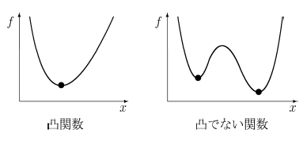
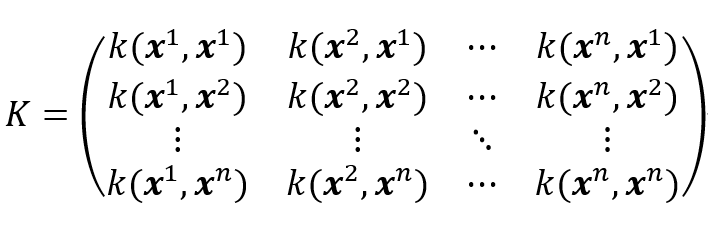
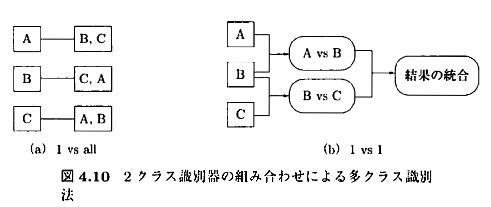

# サポートベクトルマシン (SVM) の勉強メモ

この記事は、MATLABアドベントカレンダー（その2）の12日目の記事として書かれています。

[https://qiita.com/advent-calendar/2022/matlab](https://qiita.com/advent-calendar/2022/matlab)

  
# 1 はじめに

本記事では、サポートベクトルマシン（Support Vector Machine: SVM）の仕組みについてまとめます。

サポートベクトルマシンは複数の次元を有するデータを超平面で分離する手法として有名です。色々な場面で利用でき、機械学習の代表的な手法の1つ言えます。以下の図は、3つの変数をもつデータを2つのクラスに分類しているときの図です。各軸が、それぞれの変数に対応しています。また、赤色の局面（超平面）によって、2つのクラスに分類されます。この図は3変数の場合を示していますが、これがより多くの変数の数（次元）になっても問題ありません。このように2つのクラスを超平面（曲面）でうまく分類できると非常に便利そうで、かつおもしろいです。本記事では、このサポートベクトルマシンがどのように計算されるのかを紹介したいと思います。


このサポートベクトルマシンの分離平面を可視化するためのコード (Python、MATLAB）は以下のブログやfile exchangeにて公開しています。もしよろしければ、こちらもご覧ください。

**過去の記事：サポートベクターマシン（SVM）の分離平面の可視化 (Python, MATLAB)**

[https://kentapt.hatenablog.com/entry/2022/05/23/111128](https://kentapt.hatenablog.com/entry/2022/05/23/111128)

**File Exchange: Visualizing a hyper-plane in SVM classifier（SVMの分離境界面の可視化）**

[https://jp.mathworks.com/matlabcentral/fileexchange/74442-visualizing-a-hyper-plane-in-svm-classifier-svm?s_tid=FX_rc2_behav](https://jp.mathworks.com/matlabcentral/fileexchange/74442-visualizing-a-hyper-plane-in-svm-classifier-svm?s_tid=FX_rc2_behav)

  

また、本記事を執筆するにあたり、私の理解に基づき、2クラス分類のサポートベクトルマシンを1から実装し（ただしかなりおおばっぱな実装です）、以下のようなそれらしい結果を得ることができました。赤丸と青丸がそれぞれ異なるクラスに属するサンプルで、赤線と青線がそれぞれを分類（分離）する境界です。赤色および青色のサンプルはそれぞれ、同じ色の境界で囲まれていて、うまく分類ができていそうです。

下の図は、本記事で説明する、正則化項の値を値を変えながら学習した時の、境界です。


また、下の図は、ガウシアンカーネルのパラメータを変化させながら学習させたときの境界になります。


本記事の執筆にあたっては、

赤穂先生の「カーネル多変量解析」を非常に参考にさせていただきました。

[カーネル多変量解析―非線形データ解析の新しい展開 (シリーズ確率と情報の科学) | 赤穂 昭太郎 |本 | 通販 | Amazon](https://www.amazon.co.jp/gp/product/4000069713/ref=dbs_a_def_rwt_bibl_vppi_i0)

非常にわかりやすい書籍であり、大変おすすめです。

## 注意1：説明する流れについて

サポートベクトルマシンについて説明する方法として、

1) 「マージンの最大化」

2) 「損失関数＋正則化項」

といった複数の説明の方法があります。ネットの記事では1で説明するものも多いですが、本記事では、2）のアプローチで説明することを試みます。

## 注意2: サポートベクトルマシンのという用語について

本記事では、サポートベクトルマシンを2つのクラスに分類するアルゴリズムとして説明しています。多クラスに分類する際の方法も7章にて述べます。

# 2 サポートベクトルマシンの導入について

まずは、簡単にするために、データの分布と、サポートベクトルマシンの境界を2次元で見てみます。

以下の図を見てください。赤色と青色がそれぞれ異なるクラスに属するサンプルで、x, yがそれぞれのサンプルの持つ変数の値を示します。Boundaryという境界も直線で示されています。この境界の右上が「クラス1」、左下が「クラス-1」を示します。


このように、直線や曲線で境界が定義できれば、簡単にクラスの分類ができそうです。ただ、その境界はどのようにして作ればいいのでしょうか。

以下に示す、私の投稿した過去の記事では、線形回帰（単回帰・重回帰分析）の式の重みを解析的に求めていました。

**線形回帰（単回帰分析）を1から実装して理解を深めてみよう**

[https://kentapt.hatenablog.com/entry/matlabAdventDay4](https://kentapt.hatenablog.com/entry/matlabAdventDay4)

**線形回帰（単回帰分析）を1から実装して理解を深めてみよう: つづき**

[https://kentapt.hatenablog.com/entry/matlabAdventDay5](https://kentapt.hatenablog.com/entry/matlabAdventDay5)

**重回帰分析の勉強＆実装による検算をしてみよう**

[https://kentapt.hatenablog.com/entry/matlabAdventDay6](https://kentapt.hatenablog.com/entry/matlabAdventDay6)

そこでは、以下のような式を定義して、最小二乗法によって、その係数（最小二乗推定量）を求めました。

　...(1)

線形回帰の場合の損失関数は以下のようなものでした。この値が小さいほど、予測の誤差が小さいことを示しています。

 ...(2)

前回の記事では、正解ラベルyと予測値の値の差分を二乗し、その和を最小にする係数を解析的に計算しました。

今回の、サポートベクトルマシンでは、各サンプルをカテゴリーに分ける（ラベルは1 や -1）ことを目指します。

線形回帰の場合は、誤差は4である、とか、10である、といった値が返され、計算が簡単にできました。

しかし、カテゴリー分けの場合は、その分類が 間違ってる or 正解 の2択になるため、その2乗誤差による評価は直接的に利用することができません。もちろん、ニューラルネットワークのように2乗誤差による評価を利用可能にすることも考えられますが、ひとまず今は以下に述べる方法によって、サポートベクトルマシンの分類の性能を評価します。

sign (sng)を符号関数を利用します。

符号関数については、以下のページがわかりやすかったです。

[https://mathlandscape.com/sign-function/](https://mathlandscape.com/sign-function/)


...(3)

符号関数（以下、`sgn`と表す）を用いて、サポートベクトルマシンの演算結果が0以上の場合は、1を、0より小さい場合は-1になるようにすることができます。なお、ここでは、演算結果が0の場合も、1を返すようにしています。なお、はサポートベクトルマシンにサンプルを入力した時に利用する関数で、ざっくりいうと、サポートベクトルマシンの中身、といったふうにも言えると思います。

すると、損失関数は以下のように定義することができます。


...(4)

の値は、先ほど述べたように、1か-1でした。yは正解ラベルで同様に1か-1を示します。クラスの名前を与えるとすると、クラスAやクラスBというふうに言い換えることもできます。これにより、サポートベクトルマシンの演算結果が正解の場合、損失は0、そうでない（間違えている）場合は1になることがわかります。具体的な例は後で挙げることにして、ここでは式の整理を進めます。


...(5)


...(6)

(6)式を得たところで、yのパターンと、そのサンプルの推論結果が正しい/間違い場合の、損失関数の値を確かめてみます。yが1/-1の場合と、それぞれで正解/不正解 の場合があるため、4通りの場合が存在します。それぞれについて確認してみます。

が1で  が1 (正解）　⇒　 = 0

が1で  が-1 (不正解）　⇒　 = 1

が-1で  が-1 (正解）　⇒　 = 0

が-1で  が1 (不正解）　⇒　 = 1

...(7)

以上のように、それぞれの場合において、正解の時は損失が0、不正解の時は損失が1になっていることがわかります。

このルールで、適切に誤差を評価できそうです。この誤差が0（ゼロ）であれば、そのサンプル（訓練データ）中のミスもゼロとなります。そのため、この誤差をゼロにするような関数 を求めればよいことがわかります。

しかし、(6)式では、凸関数になっていないという問題があります。以下の図を見てください。

凸関数では、「コブ」が1つだけ存在します。一方、凸関数でない関数は、「コブ」が複数存在します。

凸関数の場合は、最適解を求めやすいです。直感的に言うと、右と左を見て、その点が下方向にあれば、その点が最小値を取っていることがわかります。一方、凸関数でない場合は、関数全体の値を見渡し、その中での最小値を探す必要があります。



**画像出展：凸関数と凸でない関数**

[https://www.i.u-tokyo.ac.jp/news/focus/080215_1z2.shtml](https://www.i.u-tokyo.ac.jp/news/focus/080215_1z2.shtml)

  

(6)式と似た形で、かつ凸関数の損失関数を用意するために、ヒンジ関数を導入します。

すると、(6)式は以下のように書き換えることができます。


...(8)

(8)式をより具体的にイメージするために、以下の図を見るとわかりやすいと思います。

(8)は b = 0 の場合と考えてください。0との2つの値を比べます。0というのは、サポートベクトルマシンの予測結果が正しい場合です。一方、の値が採用される場合は、その推論が正しくない場合です。例えば、y = 1 のサンプルに対して、負の値（正しくない）である -10 を返した場合を考えます。この場合、の値は11となり、では、11という値が採用されることになります。


**画像出展：ヒンジ関数の意味、損失関数として使えることの大雑把な説明**

https://mathwords.net/hinge

  

このを利用すると、(7)は以下のように書き換えることができます。

が1でが0以上 (正解）⇒ 

が1でが0 より小さい(不正解）⇒ 　

が-1でが0 より小さい (正解）⇒ 

が-1でが0以上(不正解）⇒ 

...(9)

このように、予測が正解の場合は、そして、不正解のときは正の誤差値を返すことがわかります。

# 3. カーネル関数の利用

前節では、というヒンジ関数を用いた損失関数を定義しました。

多次元の入力に対して、ラベルが1の場合は、0以上、ラベルが-1の場合は、0より小さい値を返すとよい、という設定でした。

非常にシンプルに考えると、以下のような線形回帰（単回帰）のような形でもよさそうです。


...(10)

ここで、以前のブログ記事で、カーネル法による回帰を紹介しました。

[https://kentapt.hatenablog.com/entry/entry/matlabAdventDay11](https://kentapt.hatenablog.com/entry/entry/matlabAdventDay11)

カーネル法を利用することで、以下の図のようにグネグネとした曲線を描くことができ、

正則化などを利用しない場合は、サンプル（訓練データ）に完全にフィットする曲線を得ることができるのでした。


サポートベクトルマシンの場合について考えます。以下の図の左の図が直線で青と赤のクラスを分類しています。

右の図のような場合はどうでしょうか。左の例のように直線ではきれいに分けることができず、図のように曲がった形の分離境界が必要であることがわかります。サポートベクトルマシンの場合でも、このような2次元や多次元のサンプルに対しては、このようなより複雑な分離境界を利用するほうがより高精度な分類が可能になると考えられます。


カーネル法の便利な点として、何らかのモデル式（例：を考える必要はなく、

適切なカーネル関数やグラム行列*K*を利用することで、複雑な曲線（曲面）を描くことができるのでした。

グラム行列の内容も以前の記事にて記述しています。

[https://kentapt.hatenablog.com/entry/entry/matlabAdventDay11](https://kentapt.hatenablog.com/entry/entry/matlabAdventDay11)

そこで、を$K\left(x^{\left(i\right)} ,x\right)$に読み替え、を以下のように定義します。


...(11)

また、損失関数は、正則化項を加え、以下のようになります。


...(12)

この正則化項に関しても、以前のブログ記事に詳細の記述があります。

まとめると、この(12)式を最小化する、重み  が求めるとよいことがわかります。

そして、予測の際には、

 を計算する ⇒ 正（負）なら ラベル1（-1)と分類します。

このように、損失関数や、最適化したい値を決めることができました。次の章では具体的な計算のステップについて考えていきます。

# 4. サポートベクトルマシンの学習のための具体的な計算
## 4.1. スラック変数の導入

さきほどの(12)式を解く方法をより簡単にすることを考えます。(12)式中のの値の値に応じて場合分けが生じるため、

最適化の計算が面倒になります。そこで、より式を解きやすくするために、凸二次計画問題 (**QP=(convex) quadratic programming**) に言い換えることを考えます。線形関数で表された制約条件をみたし，2次の目的関数を最小化する解を求める問題を2次計画問題といい，さらに目的関数が凸関数である場合に凸2次計画問題といいます。

\href{http://www.me.titech.ac.jp/~mizu_lab/lib/pdf/kougisiryou/suuti/handout/11/suuti_kougi11-6.pdf}{http://www.me.titech.ac.jp/\textasciitilde{}mizu_lab/lib/pdf/kougisiryou/suuti/handout/11/suuti_kougi11-6.pdf}

凸二次計画問題の場合は、既存のライブラリが色々と存在し、比較的簡単に解けるようです。

[https://www.letsopt.com/entry/2019/08/18/131125](https://www.letsopt.com/entry/2019/08/18/131125)

それでは、凸二次計画問題に言い換えてみます。


の値を（**スラック変数**）とします。すると、求めるものは、

 ...(13)

および 

...(14)

の両方を満たすの中で、最も小さいものである。

「を満たすもの中での最小値」というのは変に聞こえるかもしれません。

例えば、の値が2以上であれば、上の条件を満たす場合、この「を満たすもの中での最小値」という条件がないと、

は2でも3でも4でも、何であっても満たしてしまうことになります。

このような言い換えをすることで、式(12)の最適化の問題を、凸2次計画問題に持ち込むことができました。

や以下のようなグラム行列を利用して、



...(15)

(12)式を書き換えると、最適化する2次関数の式は、以下のようになります。


...(16)

## 4.2. ラグランジュの未定乗数法を用いた凸二次計画問題の求解

本記事では、先ほど求めた、凸二次計画問題を双対問題に帰着させて解いていきます。

式(14)のような制限のもと、式(16)の最小値を求めるには、ラグランジュの未定乗数を利用します。

ラグランジュの未定乗数法は、以下の主成分分析の記事で扱いました。本記事では省略しますが、もし興味がございましたら以下の記事もご覧ください。

[https://kentapt.hatenablog.com/entry/2022/02/16/182532](https://kentapt.hatenablog.com/entry/2022/02/16/182532)

ラグランジュ関数は、以下のようになります。


...(17)

*ここで、ラグランジュ乗数* および  を導入しました。

について偏微分をします。この値が0となるので、以下の式を得ます。


...(18)

また、グラム行列は対象行列であるため、


...(19)

です。そのため、式(18)は


...(20)

ただし、

...(21)

 

...(22)

としました。

*K*に逆行列が存在する場合、


...(23)

また、について偏微分を行うと、


...(24)

が得られます。

よって、式(23)と(24)を利用すると、式(17)は以下のように変形できます。


...(17を再掲)

を含む項をひとまとめにし、さらにを代入して、


...(25)

最後の項を整理して、


...(26)

であり、さらに2項目と4項目をまとめることができるため、


...(27)

となります。

また、0"/>および、0"/>とという条件を合わせて、


...(28)

を得ることができます。そのため、の条件下で、


を最大化するを求めればよいことがわかります。グラム行列*K*は与えられたサンプル（訓練データ）で計算できます。また、も正解ラベルのため、既知です。そのため、のみが未知です。

この凸二次計画問題は、SMO(sequential minimal optimization)と呼ばれるアルゴリズムなどを用いて

解くことができます。本記事では、SMOについては触れず、これらの手順で、を求めたらよいということで本章は終わりにしたいと思います。

## 4.3. サポートベクトルマシンの計算手順の簡単なまとめ

比較的シンプルな式(27)を得ることができました。これにより、サポートベクトルマシンの計算において、どのような手順を踏めばよいかわかりました。

1) （訓練データとして）与えられたサンプル からまでの値を用いて、カーネル法で用いるグラム行列 　を計算する

2) 式(27)をという条件下で最適化するパラメータを求める

3) 式(23)のにの値を代入し、の値を求める

4) 式(11)のという値を求める（ここでは、テストしたいデータを推論している）

5) この値が0以上であれば、クラスA、そうでなければクラスBというふうに、分類を行うことができる

  
# 5. サポートベクトルについて

4章にて、具体的なサポートベクトルマシンの学習に必要な計算について述べました。それでは、サポートベクトルマシンの名前の中の、「サポートベクトル」とは何のことでしょうか。さらに、式(27)を見ると、グラム行列Kを計算していますが、それはサンプル数×サンプル数の形をしているため、訓練データが増えれば増えるほど、非常に大きなデータになってしまいます。それでは、運用上大変になりそうです。

(17)式のに関して偏微分を行います。この値は0になるので、

のとき、


...(29)

が成り立ちます。

厳密には、カルーシューキューンータッカー (Karush-Kuhn-Tucker) 定理について触れる必要がありそうですが、ひとまずここでは、ざっくりとした議論を進めます。

式(23)のから、

のときはとなることがわかります。

つまり、となるのは、の場合に限られます。

よって、サポートベクトルマシンの計算においては、以下のヒンジ関数の図の、

折れ線の折れている点か、その左側の点のみを利用すればよいことになります。

また、右側の点は、サポートベクトルマシンの計算では登場しません。

そのため、サポートベクトルマシンの計算では、全体のサンプルが使われるわけではなく、

一部の点のみを保持すればよいことになります（**スパース性**）。一般には、サポートベクターは、もとの訓練サンプル数に比べてかなり少ないと言われています（栗田先生 サポートベクターマシン入門）。


# **6. マージン最大化について**

冒頭でも述べた通り、サポートベクトルマシンを説明する場合、「マージン最大化」が利用される場合も多いです。

赤と青のサンプルを「スパっと」わける超平面を想定し、その超平面と赤と青のサンプル（のうち最も近いもの）の距離を

最大化しようという考え方です。


**図出展：最初に学ぶ 2分類SVMモデルの基本**

[https://www.acceluniverse.com/blog/developers/2019/07/-2svm.html](https://www.acceluniverse.com/blog/developers/2019/07/-2svm.html)

  

そして、その文脈において、以下の図のように、直線や曲面で分けられない時は、

カーネル法を利用しながら、別の特徴空間にサンプルの写像をして、その特徴空間上で、線形分離をする。そうすると、以下のようなサンプルに対してもうまく分類を行うことができる、といったような説明がよくあると思います（図の出展のブログでは別の例を使ってわかりやすく説明されていました）。個人的には、サポートベクトルマシンをはじめて知ったときは、この説明はわかりやすいものの、実際の計算が想像しにくいという印象でした。しかし、本記事のような、「損失関数と正則化項の最適化」というアプローチを知ったうえでもう一度見てみると、より具体的に想像ができる気がしました。


**図出展：最初に学ぶ 2分類SVMモデルの基本**

[https://www.acceluniverse.com/blog/developers/2019/07/-2svm.html](https://www.acceluniverse.com/blog/developers/2019/07/-2svm.html)

  

そこで、今回の説明では採用しなかった、マージン最大化という観点で考えてみたいと思います。

簡単に、マージン最大化をもとに、サポートベクトルマシンを説明してみます。

以下は、冒頭で掲載した図を少し変更したものです。四角の点がそれぞれサポートベクターを示しています。


超平面の式をとし、各サンプルの値（特徴ベクトル）をとすると、

超平面と、そのサンプルの距離は


...(30)

で表すことができます。

さて、冒頭の


に合わせて、

の値が1より大きい場合は、ラベル1、

小さい場合はラベル-1を割り当てるとします。（こうなるようにωの値を等倍してうまく選ぶようにします）

このとき、式(30)で定義される、分離境界（超平面）と訓練データのサンプルの距離の最小値は、

のときの、


...(31)

となることがわかります。

このマージンを最大化する、を、別の言い方で表現すると、この式の逆数の二乗である、を最小化することになります。

この状態では、すべての点をうまく分類するための、超平面を作成することを念頭に置いています。

しかし、カーネル法による回帰の記事にもあったように、外れ値に対しても敏感に反応する超平面を作成すると、

他のデータに対して対応できない（過学習）ものになってしまいます。

そのため、誤分類を許さない今回の想定（**ハードマージン**）ではなく、いくつかの誤分類は許容し（**ソフトマージン**）、より滑らかな超平面を作成するために、正則化項に相当するものを追加します。

式(14)のスラック変数と同様に、

1-\xi_i"/>

...(32)

という制約を設けて、


...(33)

を満たす、ωを見つければよいことになります。λは、誤分類が発生した時に加えるペナルティ項の係数（正則化項の係数）です。

ここで、


...(34)

と置くと、


...(35)

となります。

4.1で述べた、最小化する損失関数は以下のようになっていました。


...(16の再掲)

式(33)を式(35)を利用して変形すると、


...(36)

となり、とすれば

4章で示した方法と、等価な式を得ることができました。 

このように、「損失関数＋正則化項」を最小化する枠組みで説明した場合でも、「マージンの最大化」を考えた場合も、同じ計算をしていることになります。おもしろいですね。

# 7. 複数クラスの分類について

これまで述べてきたように、サポートベクトルマシンは2つのクラスの分類に利用可能です。しかし、3つ以上のクラスに分類したい場合も多く存在します。

多クラスの分類として知られている方法の例を挙げます。

   -  one vs all (1対他方式) 
   -  one vs one (1対1方式) 
   -  誤り訂正出力符号 



**図出展：カーネル多変量解析 p.119**

## 7.1. one vs all (1対他方式)について

上図の(a)にあるように、各クラスとその他のクラス、という分類器をそれぞれ用意します。

**利点**

   -  シンプルでわかりやすい。 

**欠点**

   -  全ての分類器で、all側になる場合や、複数のパターンで、one側になる（1つの分類器だけ、そのクラスを支持してくれると嬉しいがそうならない場合が多い。分離境界までの距離を基準にすることも考えられるが、サンプル数がクラス間で異なっていたりすると、フェアに判断することが難しくなる。） 
   -  クラス間のサンプル数が不均衡である場合、学習が難しくなる。 

## 7.2. one vs vs one (1対1方式)について

上図の(b)にあるように、1クラスどうしを比較するように、学習器をたくさん用意する。

**利点**

   -  one vs allのようなサンプル数が不均衡である場合でも対応しやすくなる。 

**欠点**

   -  クラスの数が増えるに従い、用意すべき学習器の数が膨大になる。 

## 7.3. 誤り訂正出力符号を用いた方法

詳しくは以下のサイトをご覧ください。

**朱鷺の杜Wiki　誤り訂正出力符号**

[https://ibisforest.org/index.php?%E8%AA%A4%E3%82%8A%E8%A8%82%E6%AD%A3%E5%87%BA%E5%8A%9B%E7%AC%A6%E5%8F%B7](https://ibisforest.org/index.php?%E8%AA%A4%E3%82%8A%E8%A8%82%E6%AD%A3%E5%87%BA%E5%8A%9B%E7%AC%A6%E5%8F%B7)

**サポートベクトルマシンの多クラス分類への適用**

[https://deus-ex-machina-ism.com/?p=23045](https://deus-ex-machina-ism.com/?p=23045)

# 8. MATLABでのパラメータ設定を見てみよう

サポートベクトルマシンの仕組みや、そこで必要な設定値をまとめてきました。実際に、サポートベクトルマシンを実行するときに、以上のパラメータ調整が可能であることを確認していきます。

今回は、ドキュメントが充実している、MATLABを例に考えます。以下に、主要なものを挙げます。

以下のドキュメントを参照します。

**`fitcsvm関数`**

2クラスの分類、または、1クラス (one-class SVM。本記事では、紹介しません)の分類に利用可能なサポートベクトルマシンの関数。

[https://jp.mathworks.com/help/stats/fitcsvm.html](https://jp.mathworks.com/help/stats/fitcsvm.html)

  

**`fitcecoc関数`**

「サポートベクターマシンまたはその他の分類器向けのマルチクラス モデルの近似」

[https://jp.mathworks.com/help/stats/fitcecoc.html](https://jp.mathworks.com/help/stats/fitcecoc.html)

## 8.1. ボックス制約


以下のような説明があります。

> ボックス制約は、マージンに違反している観測値に課せられる最大ペナルティを制御するパラメーターであり、過適合の防止 (正則化) に役立ちます。ボックス制約の値を大きくすると、SVM 分類器が割り当てるサポート ベクターは少なくなります。ただし、ボックス制約の値を大きくすると、学習時間が長くなる場合があります。

式(12)で導入した、正則化項の係数であると思われます。これを大きくすることで、過適合（overfitting)を防ぐことができますが、同時に、分離境界の超平面が滑らかになりすぎて、認識能力が下がる可能性もあるのでうまくバランスをとる必要があります。

## 8.2. カーネル関数


式(11)で導入した、カーネル関数の中身のことです。再掲になりますが、以前のカーネル関数の記事もご覧ください。i番目とj番目のサンプルを何らかのルールで計算させてグラム行列を作るのでした。私のブログ記事では、ガウシアンカーネルを利用していました。線形カーネル、多項式カーネル、カスタマイズしたカーネルなど、色々と利用が可能です。

[https://kentapt.hatenablog.com/entry/entry/matlabAdventDay11](https://kentapt.hatenablog.com/entry/entry/matlabAdventDay11)

## 8.3. カーネル関数のスケール

上の過去のブログ記事でも、ガウシアンカーネルのパラメータについて記述していました。

上の記事では、式3-1に相当する内容です。

例えば、ガウシアンカーネルを以下のように設定したとします。


その場合は、以下のように設定するとよいそうです。

```matlab:Code
mdlSVM = fitcsvm(..., 'KernelScale', 1/sqrt(gamma));
```

**出展：MATLAB answers "Gaussian kernel scale for RBF SVM"**

https://jp.mathworks.com/matlabcentral/answers/328796-gaussian-kernel-scale-for-rbf-svm

## 8.4. 最適化ルーチン


式(28)周辺で、の条件下で、


を最大化するを求めるという、凸二次計画問題を解けばよい、ということを示しました。

本文中で説明した、SMOに加え、他のアルゴリズムも利用可能です。

## 8.5. キャッシュサイズ

カーネル法の際に用いる、グラム行列Kは、サンプルの数が多くなればなるほど、2乗のスケールで大きくなり、計算が大変そうだという、話をしていました。サポートベクトルマシンの計算をする際に、確保するメモリサイズに関するパラメータだと思います。


## 8.6. 多クラス分類をする際の方式

7章で述べたような、本来2クラスの分類に利用可能なサポートベクトルマシンを用いて、多クラスの分類をする際の方式です。上で述べた、one vs oneやone vs allに加えて、色々な方式が利用可能です。


# 8.7. Standarize

入力データを標準化する/しないを設定するもの。


# 8.8. 誤分類のコスト

例えば、AというものをBと間違えてしまった時のコスト（ペナルティ）の値を制御します。例えば、犬と猫を見分ける場合を考えます。訓練データ内に犬が90匹、猫が10匹存在するとします。その場合、学習せずとも、「全て犬である」と答えると精度は90%になってしまいます。このようなクラス間でデータ数が不均衡である場合などに、このコストを調整するといいと思われます。例えば、猫なのに、犬と訓練すると、非常に大きなペナルティ（損失）を与えるようにします。簡単にするために、クラス数の逆比を用いて、猫を犬と判断した場合に、9倍のペナルティを与えるようにすると、このような「全て犬という」事態はさけられそうです。


# 9. まとめ

かなり長くなりましたが、ここまで読んでいただき誠にありがとうございました。本記事では、

   -  サポートベクトルマシンの概要と、その学習時の計算について説明を行いました。 
   -  損失関数と正則化項の最適化に焦点を当てて、サポートベクトルマシンの計算方法について述べました 
   -  別の切り口である、「マージン最大化」で説明を行っても、等価な数式に帰着することを述べました 
   -  MATLABを例に、ソフトウェアで実行するときのパラメータについて述べました 
   -  この記事が、サポートベクトルマシンを理解するうえでのきっかけとなれば幸いです。 

注意点としては、

   -  学習の基本的なところは、単回帰や、重回帰に関する過去の記事でカバーしていますのでそちらもご覧ください。 
   -  カーネル法に関しても、過去のカーネル法による回帰の記事でカバーしていますのでそちらもご覧ください。 
   -  筆者も細部については、勉強中のところが多く、わかりにくかったり、修正すべき点があるかもしれません。その場合は教えていただけますと幸いです。 

# 参考文献

**「カーネル多変量解析」赤穂昭太郎先生**

[カーネル多変量解析―非線形データ解析の新しい展開 (シリーズ確率と情報の科学) | 赤穂 昭太郎 |本 | 通販 | Amazon](https://www.amazon.co.jp/gp/product/4000069713/ref=dbs_a_def_rwt_bibl_vppi_i0)

**「サポートベクターマシン」 赤穂昭太郎先生 **

\href{https://www.ism.ac.jp/~fukumizu/ISM_lecture_2006/svm-ism.pdf}{https://www.ism.ac.jp/\textasciitilde{}fukumizu/ISM_lecture_2006/svm-ism.pdf}

**「サポートベクターマシン入門」栗田多喜夫先生 **

[https://home.hiroshima-u.ac.jp/tkurita/lecture/svm.pdf](https://home.hiroshima-u.ac.jp/tkurita/lecture/svm.pdf)

**不等式条件下におけるラグランジュの未定乗数法**

[https://laid-back-scientist.com/lagrange-multiplier2](https://laid-back-scientist.com/lagrange-multiplier2)

**SVMの2次計画問題に関する解法の考察**

[http://numaf.net/Z9/Z9a/html/THESIS/H15/abst_toda.pdf](http://numaf.net/Z9/Z9a/html/THESIS/H15/abst_toda.pdf)

**サポートベクターマシンとは［ソフトマージンサポートベクターマシン］**

[https://sudillap.hatenablog.com/entry/2013/04/08/235602](https://sudillap.hatenablog.com/entry/2013/04/08/235602)

**最初に学ぶ 2分類SVMモデルの基本**

[https://www.acceluniverse.com/blog/developers/2019/07/-2svm.html](https://www.acceluniverse.com/blog/developers/2019/07/-2svm.html)

本文中に参考文献としての記載のあるものは、ここでは一部省略しています。
